# Akkaとは
Akkaはプロセッサ(cpu)・JVM・ネットワークをまたがったシステムを設計するためのオープンソースライブラリです。
Akkaで作成されたシステムは[リアクティブ宣言](https://www.reactivemanifesto.org/ja)に則った弾力的で耐障害性のあるシステム構成を低レイヤーなコードを書かなくても容易に達成することができ、コアドメイン(会社の主要な製品)の開発に集中することができます。

現在の多くの開発手法やオブジェクト指向などのプログラミングモデルは、複数台のコンピューターが同時に稼働するマイクロサービスのような最新のアーキテクチャと適合しておらず開発には相当な労力を求められます。
例えば、マイクロサービスを構成する一つのコンピューターが破損したり、マイクロサービス間でのメッセージがいきなり紛失したりといった障害は、注意深く管理されたAWSなどのデータセンター内でも起こりうる可能性があり、それを考慮して設計をするのは至難の技です。

このような問題に対処するために、Akkaでは以下のような機能を開発者に提供しています。

* アトミックなロック(排他制御)などの低レベルな並行処理は非常に難しいですが、Akkaではこういった小難しい動作を気にしなくてもパフォーマンスの良い並列処理を提供。
* システム間のリモート通信(メッセージ)は難しいネットワークコードの記述と保守から開放し、位置透過性という特性でローカルでもクラスターでもまったく同じ手法でアクター間のメッセージ通信を実現します。
* AkkaClusterを利用した高可用性のあるアーキテクチャは弾力性と耐障害性を提供します。つまりマイクロサービスが作りやすくなります。

これらを実現するためにAkka内部ではアクターモデルというアーキテクチャを採用しています。
アクターモデルはAkkaが提供するライブラリの全てに使われているので、アクターモデルを理解するとAkkaライブラリ群の挙動を一貫して理解することが可能です。
Akkaではマイクロサービスを構成する上での問題を解決するためのライブラリが多数用意されており、それを組み合わせることでリアクティブなシステムを構築することが可能になります。

 
 

# Akkaが求められる理由
アクターモデルは1973年に[カールヒューイット](https://en.wikipedia.org/wiki/Carl_Hewitt#Actor_model)により提案されました。
はるか未来では高性能なコンピューターと高性能ネットワークが出現すると考え、そのリソースを利用し高度な並列処理ができるようになると予想し提案された方法です。
そして現在、ハードウェアとインフラの性能は1973年当時より遥かに向上し、カールヒューイット氏が当時考えていたアクターモデルを実現することが可能となりました。
その結果、従来のOOP(オブジェクト指向)では解決できなかった問題がアクターモデルの恩恵により解決できる可能性が生まれたのです。

 

## ムーアの法則の限界
1965年にCPUに搭載されるトランジスタは１年で２倍に増えていくという[ムーアの法則](https://ja.wikipedia.org/wiki/%E3%83%A0%E3%83%BC%E3%82%A2%E3%81%AE%E6%B3%95%E5%89%87)が発表されました。
ところが1975年には２年で２倍になると下方修正され、2000年代からは殆どCPU単体での性能アップが見込めなくなってしまったのです。
シングルコアの性能を上げるのではなく、多コア化により性能を向上させるという路線にシフトしておりソフトフェア側も多コアの恩恵を受けられるような非同期・並列処理を意識したコーディングをしなければ高速なアプリケーションが構築できなくなってしましました。 
(しかし、非同期・並列化を意識したコーディングは非常に奥深く難しい...)

 

## ユーザーの要求上がりすぎ問題
今までの巨大なアプリケーションは数秒の応答時間、数時間のメンテナンスが許容され、同時にやり取りされるにデータは数ギガ程度でした。
しかし、モバイル機器の爆発的な普及やGoogleやMicrosoftといった海外のメガテック会社が作る高可用性な使いやすいアプリケーションに慣れ親しんだユーザーはミリ秒単位の応答時間、100％の可用性を求めるようになっていきました。

現在広まっている主要なアーキテクチャでこのようなアプリケーションを構築するのは非常に困難です。

 

# アクターモデルを使うとなにが嬉しいのか
繰り返しになってくどいですが、一般的なプログラミング手法ではユーザーからの要求が過激な最新のシステムのニーズに対応することが難しいです。
アクターモデルを使うとどのように超規模アプリケーションを構築する際の問題を解決できるのか主な利点をいくつか紹介します。

 

## メッセージパッシングによりロックやブロッキングを回避できる
一般的なオブジェクト指向プログラミングではメソッドを繰り返し呼び出しながらシステムを構築しますが、メッセージパッシングではアクターがお互いにメッセージを相互に交換し合います。
これらの違いはスレッドのブロックにあり、メソッド呼び出しでは戻りが返ってくるまでの間送信元のスレッドがブロックされた状態になります。

しかしメッセージパッシングは送信した後スレッドをブロックすることなく継続し、他の処理を受け持つことができます。 
(C#のasync awaitみたいな感じ) 
これにより、同じ時間でより多くの処理を達成することが可能となりました。

またメッセージパッシングとメソッド呼び出しの決定的な違いは戻り値が無いことです。
ではどうやってメッセージパッシングは結果を受け取るんだ？？となりますよね。これは送信元のアクターへ`結果のメッセージを送信`するという形によって解決されます。
アクター間の問い合わせや結果などのやり取りはすべてノンブロッキングな`メッセージ`によりやり取りされるのです。

また、アクターはメッセージを受け取るとアクター内で定義されたBehavior(振る舞い)で処理しますがその順序は１度に一つづつなので他のスレッドと競合すると言った問題が起こりません。
C#のlcokステートメントやJavaのAtomicIntegerのような排他制御を書いた人は多いと思いますが、それらを一切考慮する必要がなくなります。
メッセージパッシングを利用すると脳死で非同期、並列処理への複雑な問題に対処できるようになるのです。

ちなみにスレッドロックが発生しないので数百万のアクターを数十のスレッドで効率的にスケジューリングすることが可能となり、現在のCPUの性能をフルに発揮することが可能になり多コアCPUならその分性能を引き出せます。

 

## スーパーバイザによる障害の克服
メッセージパッシングではアクター間でコールスタック(例外のスタックトレースとかの情報)を共有しないので、呼び出し元で例外の取得といった当たり前の考え方が使えません。ではどうしたら良いのでしょうか？
エラーにはおよそ２種類あり、それによって対処法が変わってきます。

### 1_タスクのエラー(想定されたエラー)
存在しないユーザーのIDでユーザーを問い合わせしてしまったみたいな、ドメインで想定されたエラーのことです。
この場合、送信元アクターにエラーメッセージ(ユーザーが見つからんよ)返信する必要があります。
エラーはドメイン知識の一部であり、通常のメッセージと同じ位置づけなのです。

### 2_内部的な障害(想定外のエラー)
データベースに接続できなかったとか、アクターを管理するメモリが破損したなどの想定されないエラーです。簡単に言うと例外です。

これは後に解説しますがアクターは階層構造を持っています。
子アクターで例外が発生し、子アクターが破損してしまった際は親アクターがその挙動を管理することができます。 
(再起動するとか、停止するとか..) 
また、親アクターが一度停止すると子アクターも全て停止します。
akkaではこれをスーパーバイザ戦略と呼び、Akkaの極めて重要な機能の一つと位置づけられています。

 

## 工凝集になりやすい
アクターは受け取るメッセージとそのメッセージに対する振る舞いを定義するので勝手に高凝集な設計になりやすいです。 
(DDDの値オブジェクトみたいな考え方を強制される) 
一般的に良いシステムとは高凝集で低結合であるべきとされています。
余談ですがAkka公式では、アクターモデルはOOPの柱の一つであるカプセル化を極限まで追求したプログラミングスタイルみたいなことを言ってます。

 
 

# Akkaが提供するおもな機能一覧

## Actor
Akkaのコアライブラリです。Akka内ののライブラリのほぼ全てで使用されており一貫した結合モデルをakka全体で提供します。
並列処理や分散システムの設計で発生する頭を悩ませるような問題を解決し、OOPの制限から開放されたシステムの構築を手伝います。

* 高性能な並行アプリケーションを設計し構築ができる
* マルチスレッド環境でエラーを適切に処理できる
* 並行処理は難しすぎるのがアクターモデルを導入するとそれがましになる

 

## Remoting
異なるコンピューター(ネットワーク越し)にアクタがーメッセージを交換することを可能にします。
設定によって簡単に有効にすることができ、APIも僅かなものしか無いのですぐ使いこなせるようになると思います。

リモートとローカルのメッセージ送信方法はまったく同じであり、ActorRef参照が提供する位置透過性によりソーカルで適応していたパターンがそのままリモートでも適応できます。
後述のClusterの土台として組み込まれており、Remotingを直接使うといった機会はぶっちゃけ殆ど無いのでこういった物があるんだな程度に...

 

## Cluster
アクターを複数のノードと呼ばれる単位に分散し、一つのクラスタを作成します。
更に具体的に言うとRemotnigがリモート間のコンポーネントやアドレスの問題を解決するものに対し、Clusterはこれらをメンバーシッププロトコルという特殊な通信でそれぞれを結びつけ一つの巨大なシステムとすることを提供します。

* クラスタのメンバー(ノード)の役割を指定する事ができ、特定のサービス(バックエンドとフロントエンド的な)に分割し管理することができる
* すでに存在するクラスターに安全にメンバーを追加できる。
* 一時的に到達不能(障害)が発生したメンバーを安全に切り離すことができる
* メンバーはお互いに相互通信が可能で、巨大なアクターシステムの集合とみなすことができる。

 

## Cluster Sharding
ShardingはAkkaクラスター上のメンバー(ノード)にアクターを分散させる機能です。
Shardingは主にPersistenceと一緒に使われることが多く、永続的なアクターの大きなセット(シャードと呼ぶ)をクラスタのメンバー上にバランスよく配置し、
メンバーがクラッシュしたり離脱した際にはそのシャードを他のメンバーに適切に振り分けることができます。

* クラスタ内のアクターが適切にう分散され、マシン間の負荷が適切に保たれる。
* クラッシュしたメンバーから、Persistenceを使うことにより状態を失うことなく復元ができる
* クラスター内に同じアクターが同時に存在しないように調節し、その結果不正義な値が生まれないようにしてくれる。

 

## Cluster Singleton
分散システムでよくあるユースケースで、ある機能を担当するエンティティをクラスタ内で一つだけ作り管理したいという場面があります。

* DNS的な一元的なネームサービス、またはルーティングサービス
* 特定のクラスタ全体で一貫した決定
* 外部システムへの単一のエントリポイント

ただ、設計で回避できるならこの機能は使わないほうが良いです。せっかくAkka Clusterで障害対策してるのにこのアクターが単一障害点になる可能性があるからです。ClusterSingleは本当に必要になったときに使うべきです。

 

## Persistence
当たり前ですがアクターの状態は揮発性であるメモリー上に保持されるのでシステムがシャットダウンもしくはクラッシュすると
メモリ内で保持していたアクタのデータは全て失われます。Persistenceはイベントソーシングを利用し状態をデータストアに保存することができるので好きなときにアクターを再構築することができるようになります。

イベントソーシングはアクターで発生したイベントを記録していく方式でそれを再生することで状態を復元します。
イベントストアへは追記しかしないのでトランザクションロック等が発生せず、アクターモデルの原則であるノンブロッキングを達成しています。

 

## DistributedData
最終的な一貫性(結果整合性って奴やな)が許容されるのであれば、クラスター内でのデータの共有にはDistributedDataが適しています。
これはCRDTという仕組みによりクラスタ内のアクターが書き込みと読み込みを同時に発生下としても、その後にいい感じにマージしてくれる機能です。あくまでも結果整合性なので各ノード内でアクセスした際に違ったデータが取得されることがあります。
といっても時間が経てばすべてのノードで同じ内容が取得できます。